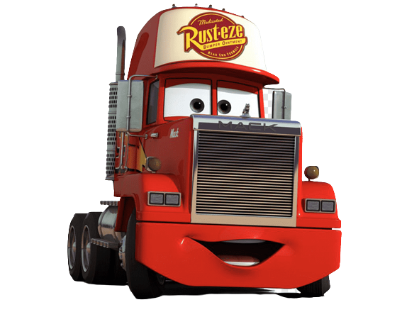

# PI - 3º Termo - RUSTEZE

## TEMA: CONTROLE DE ESTUFA
### Engine utilizada:

- [Nodejs](https://nodejs.org/)
- [Python](https://python.org/)

### Framework:

- Front-end:
    - [React](https://https://reactjs.org/);
        - [Vite](https://vitejs.dev/);
    - [FontAwesome](https://fontawesome.com/);
    - [StyledComponents](https://styled-components.com/);

- Back-end:

    - [Express](https://expressjs.com/);
    - [Helmet](https://helmetjs.github.io/);
    - [Dotenv-safe](https://npmjs.com/package/dotenv-safe/);
    - [MySQL](https://mysql.com/);
    - [Sequelize](https://sequelize.org/);

- Infra-estrutura:

    - Server-side:

        - [Docker](https://docker.com/);
        - [Zerotier](https://zerotier.com/);
        - [Openssh](https://openssh.com);

    - Physical-side:

        - ESP-8266;
        - DHT;
        - Umidade do solo;

        # MASCOTE
<<<<<<< HEAD
        
=======
        
>>>>>>> development

Build with 💙 and ☕ by:

- [JeffeVargasP](https://github.com/JeffeVargasP/)
- [GioGiuseppe](https://github.com/giogiuseppe/)
- [VictorKashima](https://github.com/VictorKashima/)
- [David Marques](https://github.com/DavidMarqss)
- [Gabriel Calil](https://github.com/calil05)
- [Marcos Sakaguchi](https://github.com/Marcossakaguchi5)
- [Luis Cavano](https://github.com/luis-cavano/)